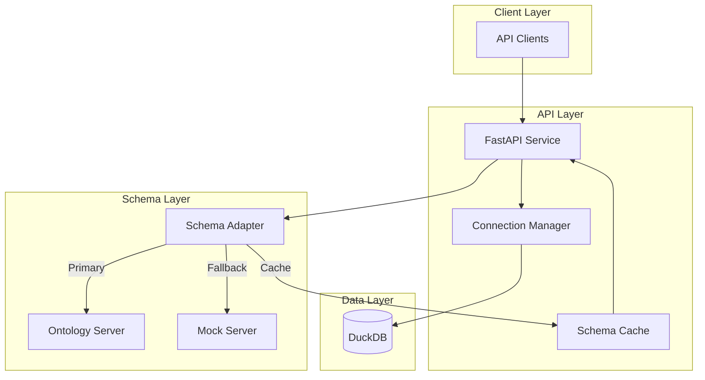

# DuckDB Spawn API

A FastAPI service that manages project data using DuckDB with dynamic schema support from an ontology server.

## Architecture



## Overview

DuckDB Spawn API provides a dynamic project management system where the database schema is controlled by an external ontology server. The system includes:

- **Dynamic Schema Management**: Database tables are created and updated based on schemas from the ontology server
- **Connection Management**: Thread-safe DuckDB connections with proper transaction handling
- **Mock Support**: Built-in mock responses for development when the ontology server is unavailable
- **Health Monitoring**: System metrics and health checks including ontology server status

## Key Features

- Async API endpoints for project management
- Schema-driven database operations
- Prometheus metrics integration
- Structured JSON logging
- Health monitoring endpoints
- Mock server support for development

## Configuration

Environment variables:

```bash
# Ontology Server Configuration
ONTO_SERVER_URL=http://localhost:8001
ONTO_SERVER_TIMEOUT=5
USE_MOCK_ONTO_SERVER=true  # Use mock responses for development

# Database Configuration
DUCKDB_PATH=data_product.db
```

## API Endpoints

### Operations

- `POST /ops/projects`: Create a new project
- `GET /ops/projects`: List all projects
- `GET /ops/projects/{project_id}`: Get project details
- `POST /ops/initialize`: Initialize database with schema

### Admin

- `POST /admin/tables`: Create tables from schema
- `GET /admin/tables`: List all tables
- `PUT /admin/tables/{table_name}`: Update table schema
- `DELETE /admin/tables/{table_name}`: Delete table
- `POST /admin/logging/level`: Update logging level

### Monitoring

- `GET /monitoring/health`: System health status
- `GET /monitoring/metrics/system`: System metrics

## Development

1. Clone the repository

2. Create a virtual environment:

```bash
python -m venv .venv
source .venv/bin/activate  # Unix
.venv\Scripts\activate     # Windows
```

3. Install dependencies:

```bash
pip install -r requirements.txt
```

4. Run the application:

```bash
uvicorn src.main:app --reload
```

## Testing

Run tests with pytest:

```bash
pytest
```

## Project Structure

```text
duckdb-spawn/
├── config/
│   ├── __init__.py
│   ├── onto_server.py           # Schema server interface
│   └── mock_onto_responses.py   # Mock responses
├── src/
│   ├── __init__.py
│   ├── main.py
│   ├── routes/
│   │   ├── admin.py            # Admin endpoints
│   │   ├── operations.py       # Project operations
│   │   └── monitoring.py       # Health checks
│   ├── database/
│   │   ├── connection_manager.py
│   │   └── schema.py
│   └── utils/
│       ├── logging_config.py
│       └── metrics.py
└── tests/
    └── test_routes/
```

## License

MIT License

## Contributing

1. Fork the repository
2. Create a feature branch
3. Commit your changes
4. Push to the branch
5. Create a Pull Request

## Contact

- Author: Jean-Baptiste Dezard
- Email: [jeanbapt@dealexmachina.com](mailto:jeanbapt@dealexmachina.com)
- Project: [GitHub Repository](https://github.com/jeanbapt/duckdb-spawn)
