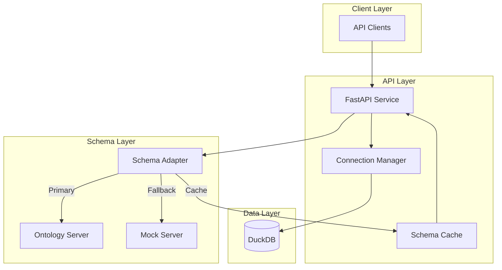
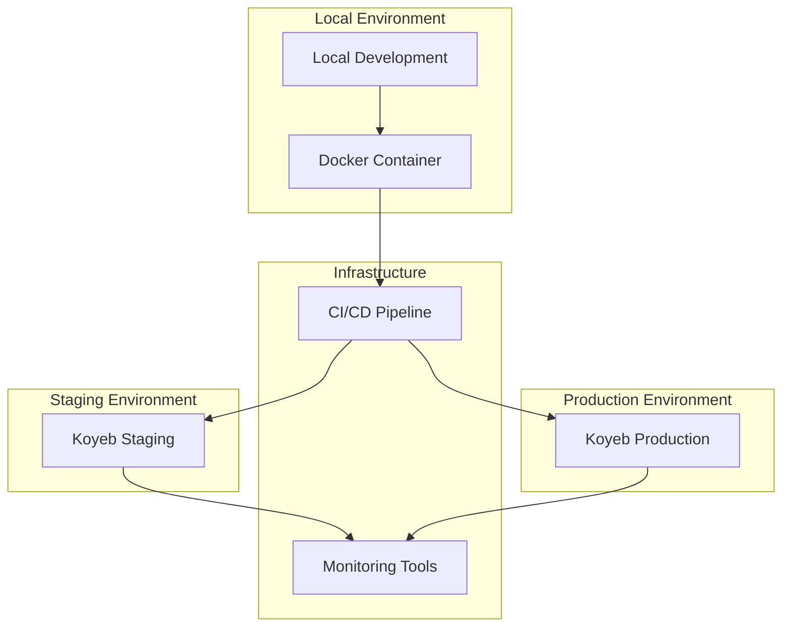

# DuckDB Spawn API

A FastAPI service that manages project data using DuckDB with dynamic schema support from an ontology server. The service is designed as a modular, self-contained data product following data mesh architecture principles.

## Architecture Overview



## Deployment Architecture



## Data Mesh Architecture Integration

DuckDB Spawn API is designed as a domain-oriented, self-contained data product within a data mesh architecture. It embodies the key principles of data mesh:

1. **Domain Ownership**: Encapsulates project financing data domain with complete ownership over data storage, processing, and schema evolution
2. **Data as a Product**: Provides well-defined APIs, documentation, and SLAs for data consumers
3. **Self-serve Data Platform**: Uses infrastructure-as-code, containerization, and automated deployments for self-service capabilities
4. **Federated Computational Governance**: Schema definitions from an ontology server implement federated governance while maintaining domain autonomy

### Why This Matters

In a traditional data lake/warehouse architecture, this functionality might be implemented as tables in a central database, managed by a separate data team. In our data mesh approach:

- Domain experts own both the code and data for their domain
- Data schema evolves independently but adheres to organizational standards via the ontology server
- The service is deployable independently without complex dependencies
- Consumers interact with the data through APIs rather than direct database access

## Architectural Decisions

### Why DuckDB?

DuckDB was selected for several strategic reasons:

- **Analytical Performance**: DuckDB excels at analytical queries, which align with project financing data needs
- **Embeddable Nature**: No separate database server infrastructure required, simplifying deployment
- **Columnar Storage**: Efficient storage and querying for project metrics and time-series data
- **Low Operational Overhead**: Fits the data product model where each domain owns its complete stack
- **Schema Flexibility**: Easily adaptable to changing schema requirements while maintaining performance

### Why Dynamic Schema from Ontology Server?

The ontology server integration provides several benefits:

- **Schema Governance**: Centralized schema definitions while maintaining domain autonomy
- **Evolution Control**: Schema changes can be coordinated across multiple data products
- **Self-documenting API**: API capabilities automatically reflect the current schema
- **Fallback Mechanism**: Mock server ensures availability even when the ontology server is down

### Connection Management Design

The connection pool implementation:

- **Thread Safety**: Ensures concurrent requests don't conflict when accessing the database
- **Resource Efficiency**: Reuses connections to minimize overhead
- **Proper Cleanup**: Ensures connections are properly closed to prevent resource leaks

## Key Features

- **Domain-Oriented Data Product**: Complete encapsulation of project financing data domain
- **Dynamic Schema Management**: Database tables are created and updated based on schemas from the ontology server
- **Connection Management**: Thread-safe DuckDB connections with proper transaction handling
- **Mock Support**: Built-in mock responses for development when the ontology server is unavailable
- **Health Monitoring**: System metrics and health checks including ontology server status
- **Containerized Deployment**: Self-contained, portable, and consistently deployable
- **Infrastructure as Code**: Reproducible infrastructure defined in Pulumi
- **API-First Design**: Clean, well-documented API endpoints for all operations

## Configuration

Environment variables:

```bash
# Ontology Server Configuration
ONTO_SERVER_URL=http://localhost:8001
ONTO_SERVER_TIMEOUT=5
USE_MOCK_ONTO_SERVER=true  # Use mock responses for development

# Database Configuration
DUCKDB_PATH=data_product.db
```

## API Endpoints

### Operations

- `POST /ops/projects`: Create a new project
- `GET /ops/projects`: List all projects
- `GET /ops/projects/{project_id}`: Get project details
- `POST /ops/initialize`: Initialize database with schema

### Admin

- `POST /admin/tables`: Create tables from schema
- `GET /admin/tables`: List all tables
- `PUT /admin/tables/{table_name}`: Update table schema
- `DELETE /admin/tables/{table_name}`: Delete table
- `POST /admin/logging/level`: Update logging level

### Monitoring

- `GET /monitoring/health`: System health status
- `GET /monitoring/metrics/system`: System metrics

## Development

1. Clone the repository

2. Create a virtual environment:

```bash
python -m venv .venv
source .venv/bin/activate  # Unix
.venv\Scripts\activate     # Windows
```

3. Install dependencies:

```bash
pip install -r requirements.txt
```

4. Run the application:

```bash
uvicorn src.main:app --reload
```

## Testing

Run tests with pytest:

```bash
pytest
```

## Project Structure

```text
duckdb-spawn/
├── config/
│   ├── __init__.py
│   ├── onto_server.py           # Schema server interface
│   └── mock_onto_responses.py   # Mock responses
├── infrastructure/
│   ├── pulumi/                  # Infrastructure as Code
│   │   ├── __main__.py         # Main Pulumi program
│   │   ├── Pulumi.yaml         # Pulumi project file
│   │   └── Pulumi.dev.yaml     # Development stack configuration
│   ├── docker/
│   │   ├── Dockerfile          # Application container
│   │   └── docker-compose.yml  # Local development setup
│   └── monitoring/
│       ├── prometheus/
│       │   └── prometheus.yml  # Prometheus configuration
│       └── grafana/
│           └── dashboards/     # Grafana dashboard definitions
├── src/
│   ├── __init__.py
│   ├── main.py
│   ├── routes/
│   │   ├── admin.py           # Admin endpoints
│   │   ├── operations.py      # Project operations
│   │   └── monitoring.py      # Health checks
│   ├── database/
│   │   ├── connection_manager.py
│   │   └── schema.py
│   └── utils/
│       ├── logging_config.py
│       └── metrics.py
├── tests/
│   └── test_routes/
├── .github/
│   └── workflows/
│       ├── ci.yml             # CI pipeline
│       └── koyeb-deploy.yml   # Deployment pipeline
└── deployment/
    ├── staging/              # Staging environment configs
    └── production/           # Production environment configs
```

## Infrastructure

### Local Development

The project includes a Docker Compose setup for local development:

```bash
# Start local development environment
docker-compose -f infrastructure/docker/docker-compose.yml up -d

# View logs
docker-compose -f infrastructure/docker/docker-compose.yml logs -f
```

### Infrastructure as Code

The project uses Pulumi for infrastructure management:

```bash
# Initialize Pulumi stack
cd infrastructure/pulumi
pulumi stack init dev

# Deploy infrastructure
pulumi up

# Destroy infrastructure
pulumi destroy
```

### Monitoring Setup

The monitoring stack includes:

- Prometheus for metrics collection
- Grafana for visualization
- Custom dashboards for DuckDB metrics

To deploy the monitoring stack:

```bash
cd infrastructure/monitoring
docker-compose up -d
```

### CI/CD Pipeline

The project uses GitHub Actions for CI/CD:

1. **Continuous Integration**:
   - Automated testing
   - Code quality checks
   - Container image building

2. **Continuous Deployment**:
   - Automated deployment to Koyeb
   - Environment-specific configurations
   - Health check verification

### Environment Management

The project supports multiple environments:

- **Development**: Local development environment
- **Staging**: Pre-production testing environment
- **Production**: Production environment

Environment-specific configurations are managed through:
- Environment variables
- Pulumi stacks
- Koyeb configurations

## Deployment

### Koyeb Deployment

1. Set up Koyeb credentials:

```bash
export KOYEB_TOKEN=your_token
```

2. Deploy using GitHub Actions:
   - Push to `main` branch for staging deployment
   - Create a release for production deployment

### Infrastructure Updates

To update the infrastructure:

1. Modify Pulumi configurations:

```bash
cd infrastructure/pulumi
# Edit __main__.py or Pulumi.dev.yaml
pulumi up
```

2. Update monitoring configurations:

```bash
cd infrastructure/monitoring
# Edit prometheus.yml or grafana dashboards
docker-compose up -d --force-recreate
```

## License

MIT License

## Contributing

1. Fork the repository
2. Create a feature branch
3. Commit your changes
4. Push to the branch
5. Create a Pull Request

## Contact

- Author: Jean-Baptiste Dezard
- Email: [jeanbapt@dealexmachina.com](mailto:jeanbapt@dealexmachina.com)
- Project: [GitHub Repository](https://github.com/jeanbapt/duckdb-spawn)

## Documentation

Detailed documentation for the DuckDB Spawn project is available in the `docs` directory:

- [Architecture](docs/ARCHITECTURE.md): Comprehensive explanation of the system architecture and design decisions
- [Roadmap](docs/ROADMAP.md): Future development plans and feature timelines
- [Agentic Research](docs/AGENTIC_RESEARCH.md): Research initiative on agentic data products using small language models
- [Sidecar Specification](docs/SIDECAR_SPEC.md): Technical specification for the agentic sidecar implementation
