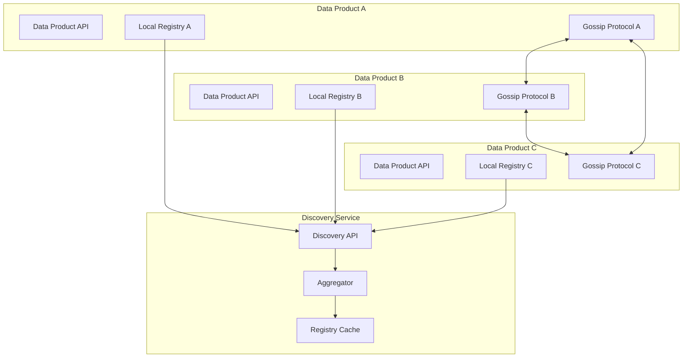

# Decentralized Catalog and Registry Architecture

## Overview

This proposal outlines a simple, decentralized catalog and registry system for data mesh architectures that enables data product discovery without central bottlenecks. The design prioritizes simplicity, resilience, and alignment with data mesh principles.

## Architecture Principles

1. **No Central Authority**: Each data product maintains its own metadata
2. **Peer Discovery**: Data products discover each other through gossip protocol
3. **Eventually Consistent**: Accept temporary inconsistencies for availability
4. **Self-Describing**: Each data product publishes standardized metadata
5. **Lightweight**: Minimal infrastructure overhead

## High-Level Architecture



## Core Components

### 1. Data Product Self-Registration

Each data product exposes its metadata through standardized endpoints:

```python
# src/catalog/self_description.py
from pydantic import BaseModel, Field
from typing import List, Dict, Optional
from datetime import datetime

class DataProductMetadata(BaseModel):
    """Core metadata that every data product must provide"""
    
    # Identity
    id: str = Field(description="Unique identifier (UUID)")
    name: str = Field(description="Human-readable name")
    version: str = Field(description="Semantic version")
    domain: str = Field(description="Business domain")
    
    # Discovery
    base_url: str = Field(description="Base API URL")
    health_endpoint: str = "/health"
    catalog_endpoint: str = "/catalog/metadata"
    
    # Description
    description: str
    owner: TeamInfo
    contact: ContactInfo
    
    # Technical
    data_formats: List[str] = ["json", "parquet", "csv"]
    protocols: List[str] = ["http", "grpc"]
    authentication: List[str] = ["oauth2", "api-key"]
    
    # Quality
    sla: SLAInfo
    quality_score: float = Field(ge=0, le=1)
    
    # Schema
    schema_endpoint: str = "/schema"
    schema_version: str
    
    # Timestamps
    created_at: datetime
    updated_at: datetime
    last_seen: Optional[datetime] = None

class TeamInfo(BaseModel):
    name: str
    email: str
    slack_channel: Optional[str]

class ContactInfo(BaseModel):
    support_email: str
    documentation_url: str
    issue_tracker_url: Optional[str]

class SLAInfo(BaseModel):
    availability: float = Field(ge=0, le=100)
    response_time_p99_ms: int
    data_freshness_minutes: int
```

### 2. Local Registry Implementation

Each data product maintains a local registry of discovered peers:

```python
# src/catalog/local_registry.py
import asyncio
from typing import Dict, List, Optional
from datetime import datetime, timedelta
import aiohttp
from sqlalchemy import create_engine, Column, String, DateTime, Float
from sqlalchemy.ext.declarative import declarative_base
from sqlalchemy.orm import sessionmaker

Base = declarative_base()

class DataProductRecord(Base):
    __tablename__ = 'discovered_products'
    
    id = Column(String, primary_key=True)
    name = Column(String, nullable=False)
    domain = Column(String, nullable=False)
    base_url = Column(String, nullable=False)
    version = Column(String, nullable=False)
    quality_score = Column(Float)
    last_seen = Column(DateTime, nullable=False)
    metadata_json = Column(String, nullable=False)  # Full metadata

class LocalRegistry:
    def __init__(self, db_path: str = "data/registry.db"):
        self.engine = create_engine(f'sqlite:///{db_path}')
        Base.metadata.create_all(self.engine)
        self.Session = sessionmaker(bind=self.engine)
        self._health_check_interval = 300  # 5 minutes
        self._stale_threshold = timedelta(hours=24)
        
    async def register_peer(self, metadata: DataProductMetadata):
        """Register or update a peer data product"""
        session = self.Session()
        try:
            record = session.query(DataProductRecord).filter_by(
                id=metadata.id
            ).first()
            
            if record:
                # Update existing
                record.name = metadata.name
                record.version = metadata.version
                record.base_url = metadata.base_url
                record.quality_score = metadata.quality_score
                record.last_seen = datetime.utcnow()
                record.metadata_json = metadata.json()
            else:
                # Create new
                record = DataProductRecord(
                    id=metadata.id,
                    name=metadata.name,
                    domain=metadata.domain,
                    base_url=metadata.base_url,
                    version=metadata.version,
                    quality_score=metadata.quality_score,
                    last_seen=datetime.utcnow(),
                    metadata_json=metadata.json()
                )
                session.add(record)
            
            session.commit()
        finally:
            session.close()
    
    async def get_peers_by_domain(self, domain: str) -> List[DataProductMetadata]:
        """Get all active peers in a specific domain"""
        session = self.Session()
        try:
            cutoff_time = datetime.utcnow() - self._stale_threshold
            records = session.query(DataProductRecord).filter(
                DataProductRecord.domain == domain,
                DataProductRecord.last_seen > cutoff_time
            ).all()
            
            return [
                DataProductMetadata.parse_raw(record.metadata_json)
                for record in records
            ]
        finally:
            session.close()
    
    async def health_check_peers(self):
        """Periodic health check of registered peers"""
        while True:
            session = self.Session()
            try:
                records = session.query(DataProductRecord).all()
                
                for record in records:
                    metadata = DataProductMetadata.parse_raw(record.metadata_json)
                    if await self._check_peer_health(metadata):
                        record.last_seen = datetime.utcnow()
                    else:
                        # Mark as potentially stale but don't remove yet
                        pass
                
                session.commit()
            finally:
                session.close()
            
            await asyncio.sleep(self._health_check_interval)
    
    async def _check_peer_health(self, metadata: DataProductMetadata) -> bool:
        """Check if a peer is healthy"""
        try:
            async with aiohttp.ClientSession() as session:
                url = f"{metadata.base_url}{metadata.health_endpoint}"
                async with session.get(url, timeout=5) as response:
                    return response.status == 200
        except:
            return False
```

### 3. Gossip Protocol Implementation

Simple gossip protocol for peer discovery:

```python
# src/catalog/gossip.py
import random
import asyncio
from typing import Set, List
import aiohttp
from .local_registry import LocalRegistry, DataProductMetadata

class GossipProtocol:
    def __init__(self, 
                 local_registry: LocalRegistry,
                 self_metadata: DataProductMetadata,
                 seed_peers: List[str] = None):
        self.registry = local_registry
        self.self_metadata = self_metadata
        self.seed_peers = seed_peers or []
        self.known_peers: Set[str] = set()
        self.gossip_interval = 60  # seconds
        self.fanout = 3  # number of peers to gossip with
        
    async def start(self):
        """Start the gossip protocol"""
        # Bootstrap from seed peers
        await self._bootstrap()
        
        # Start periodic gossip
        asyncio.create_task(self._gossip_loop())
    
    async def _bootstrap(self):
        """Bootstrap from seed peers"""
        for peer_url in self.seed_peers:
            try:
                await self._exchange_catalog(peer_url)
            except Exception as e:
                print(f"Failed to bootstrap from {peer_url}: {e}")
    
    async def _gossip_loop(self):
        """Main gossip loop"""
        while True:
            await asyncio.sleep(self.gossip_interval)
            
            # Get random subset of known peers
            all_peers = await self.registry.get_all_peers()
            if len(all_peers) > self.fanout:
                selected_peers = random.sample(all_peers, self.fanout)
            else:
                selected_peers = all_peers
            
            # Exchange catalogs with selected peers
            for peer in selected_peers:
                asyncio.create_task(self._exchange_catalog(peer.base_url))
    
    async def _exchange_catalog(self, peer_url: str):
        """Exchange catalog information with a peer"""
        try:
            async with aiohttp.ClientSession() as session:
                # Send our catalog
                my_peers = await self.registry.get_all_peers()
                my_catalog = {
                    "self": self.self_metadata.dict(),
                    "peers": [p.dict() for p in my_peers]
                }
                
                exchange_url = f"{peer_url}/catalog/exchange"
                async with session.post(
                    exchange_url, 
                    json=my_catalog,
                    timeout=10
                ) as response:
                    if response.status == 200:
                        their_catalog = await response.json()
                        await self._process_peer_catalog(their_catalog)
        except Exception as e:
            print(f"Gossip exchange failed with {peer_url}: {e}")
    
    async def _process_peer_catalog(self, catalog: dict):
        """Process catalog received from peer"""
        # Register the peer itself
        peer_metadata = DataProductMetadata(**catalog["self"])
        await self.registry.register_peer(peer_metadata)
        
        # Register their known peers
        for peer_data in catalog.get("peers", []):
            try:
                metadata = DataProductMetadata(**peer_data)
                await self.registry.register_peer(metadata)
            except Exception as e:
                print(f"Failed to register peer: {e}")
```

### 4. Discovery API Implementation

Aggregated discovery service (optional centralized view):

```python
# src/catalog/discovery_api.py
from fastapi import FastAPI, HTTPException, Query
from typing import List, Optional
from datetime import datetime, timedelta

app = FastAPI(title="Data Mesh Discovery Service")

class DiscoveryService:
    def __init__(self, registry: LocalRegistry):
        self.registry = registry
        self.cache_ttl = 300  # 5 minutes
        self._cache = {}
        self._cache_timestamp = None
    
    async def search_data_products(
        self,
        domain: Optional[str] = None,
        name_contains: Optional[str] = None,
        min_quality_score: float = 0.0,
        limit: int = 100
    ) -> List[DataProductMetadata]:
        """Search for data products with filters"""
        
        # Get all products from registry
        all_products = await self._get_all_products_cached()
        
        # Apply filters
        filtered = all_products
        
        if domain:
            filtered = [p for p in filtered if p.domain == domain]
        
        if name_contains:
            filtered = [
                p for p in filtered 
                if name_contains.lower() in p.name.lower()
            ]
        
        if min_quality_score > 0:
            filtered = [
                p for p in filtered 
                if p.quality_score >= min_quality_score
            ]
        
        # Sort by quality score and limit
        filtered.sort(key=lambda p: p.quality_score, reverse=True)
        return filtered[:limit]
    
    async def _get_all_products_cached(self) -> List[DataProductMetadata]:
        """Get all products with caching"""
        now = datetime.utcnow()
        
        if (self._cache_timestamp and 
            now - self._cache_timestamp < timedelta(seconds=self.cache_ttl)):
            return self._cache.get("all_products", [])
        
        # Refresh cache
        all_products = await self.registry.get_all_active_peers()
        self._cache["all_products"] = all_products
        self._cache_timestamp = now
        
        return all_products

discovery_service = DiscoveryService(LocalRegistry())

@app.get("/search", response_model=List[DataProductMetadata])
async def search_data_products(
    domain: Optional[str] = Query(None, description="Filter by domain"),
    name: Optional[str] = Query(None, description="Filter by name (contains)"),
    min_quality: float = Query(0.0, ge=0, le=1, description="Minimum quality score"),
    limit: int = Query(100, ge=1, le=1000, description="Maximum results")
):
    """Search for data products in the mesh"""
    return await discovery_service.search_data_products(
        domain=domain,
        name_contains=name,
        min_quality_score=min_quality,
        limit=limit
    )

@app.get("/domains", response_model=List[str])
async def list_domains():
    """List all known domains in the mesh"""
    all_products = await discovery_service._get_all_products_cached()
    domains = list(set(p.domain for p in all_products))
    return sorted(domains)

@app.get("/graph", response_model=dict)
async def get_dependency_graph():
    """Get the dependency graph of data products"""
    # This would analyze dependencies between data products
    # Implementation depends on how dependencies are tracked
    pass
```

### 5. Integration with DuckDB Spawn

Add catalog endpoints to your existing data product:

```python
# src/routes/catalog.py
from fastapi import APIRouter, HTTPException
from typing import Dict, List
from ..catalog.self_description import DataProductMetadata, TeamInfo, ContactInfo, SLAInfo
from ..catalog.local_registry import LocalRegistry
from ..catalog.gossip import GossipProtocol

router = APIRouter(prefix="/catalog", tags=["catalog"])

# Initialize catalog components
SELF_METADATA = DataProductMetadata(
    id="550e8400-e29b-41d4-a716-446655440000",
    name="Project Financing Data Product",
    version="1.2.1",
    domain="finance",
    base_url="https://finance-dp.example.com",
    description="Manages project financing data including portfolios and risk metrics",
    owner=TeamInfo(
        name="Finance Team",
        email="finance-team@example.com",
        slack_channel="#finance-data"
    ),
    contact=ContactInfo(
        support_email="finance-support@example.com",
        documentation_url="https://docs.example.com/finance-dp"
    ),
    sla=SLAInfo(
        availability=99.9,
        response_time_p99_ms=500,
        data_freshness_minutes=15
    ),
    quality_score=0.95,
    schema_version="2.1.0",
    created_at=datetime(2024, 1, 1),
    updated_at=datetime.utcnow()
)

local_registry = LocalRegistry()
gossip = GossipProtocol(
    local_registry,
    SELF_METADATA,
    seed_peers=["https://catalog-dp1.example.com", "https://catalog-dp2.example.com"]
)

@router.on_event("startup")
async def start_gossip():
    """Start gossip protocol on startup"""
    await gossip.start()

@router.get("/metadata", response_model=DataProductMetadata)
async def get_self_metadata():
    """Get this data product's metadata"""
    return SELF_METADATA

@router.post("/exchange")
async def exchange_catalogs(catalog: Dict):
    """Exchange catalog information with a peer (used by gossip protocol)"""
    try:
        await gossip._process_peer_catalog(catalog)
        
        # Return our catalog
        my_peers = await local_registry.get_all_peers()
        return {
            "self": SELF_METADATA.dict(),
            "peers": [p.dict() for p in my_peers]
        }
    except Exception as e:
        raise HTTPException(status_code=500, detail=str(e))

@router.get("/peers", response_model=List[DataProductMetadata])
async def list_known_peers(domain: Optional[str] = None):
    """List all known data products in the mesh"""
    if domain:
        return await local_registry.get_peers_by_domain(domain)
    else:
        return await local_registry.get_all_active_peers()

@router.get("/discover/{domain}", response_model=List[DataProductMetadata])
async def discover_domain_products(domain: str):
    """Discover data products in a specific domain"""
    return await local_registry.get_peers_by_domain(domain)
```

## Deployment Options

### Option 1: Fully Decentralized
- Each data product runs gossip protocol
- No central discovery service
- Clients query any data product for discovery

### Option 2: Hybrid with Discovery Services
- Data products maintain local registries
- Optional discovery services aggregate information
- Provides better search capabilities
- Discovery services can fail without breaking the mesh

### Option 3: DNS-SD Based Discovery
```python
# Alternative: DNS Service Discovery
from zeroconf import ServiceInfo, Zeroconf
import socket

class DNSSDCatalog:
    def __init__(self):
        self.zeroconf = Zeroconf()
        
    def register_data_product(self, metadata: DataProductMetadata):
        """Register data product via DNS-SD"""
        info = ServiceInfo(
            "_datamesh._tcp.local.",
            f"{metadata.name}._datamesh._tcp.local.",
            addresses=[socket.inet_aton("127.0.0.1")],
            port=8000,
            properties={
                "id": metadata.id,
                "domain": metadata.domain,
                "version": metadata.version,
                "base_url": metadata.base_url,
                "schema_version": metadata.schema_version
            }
        )
        self.zeroconf.register_service(info)
```

## Benefits of This Architecture

1. **No Single Point of Failure**: Registry is distributed across all data products
2. **Self-Healing**: Gossip protocol ensures information spreads even with failures
3. **Low Overhead**: Minimal additional infrastructure required
4. **Flexible Discovery**: Multiple discovery patterns supported
5. **Gradual Adoption**: Data products can join the catalog incrementally

## Implementation Checklist

- [ ] Define standard metadata schema (DataProductMetadata)
- [ ] Implement local registry with SQLite
- [ ] Add catalog endpoints to data products
- [ ] Implement gossip protocol
- [ ] Deploy seed nodes for bootstrap
- [ ] Optional: Deploy discovery service for enhanced search
- [ ] Create client libraries for catalog queries
- [ ] Add monitoring for catalog health

## Security Considerations

1. **Authentication**: Validate gossip exchanges with mutual TLS or tokens
2. **Data Validation**: Validate all received metadata against schema
3. **Rate Limiting**: Limit gossip frequency to prevent DoS
4. **Access Control**: Some metadata might be restricted by domain

## Monitoring

```python
# src/catalog/metrics.py
from prometheus_client import Counter, Gauge, Histogram

# Metrics for catalog operations
catalog_gossip_exchanges = Counter(
    'catalog_gossip_exchanges_total',
    'Total gossip exchanges',
    ['status']
)

catalog_peer_count = Gauge(
    'catalog_peer_count',
    'Number of known peers',
    ['domain']
)

catalog_query_duration = Histogram(
    'catalog_query_duration_seconds',
    'Catalog query duration'
)
```