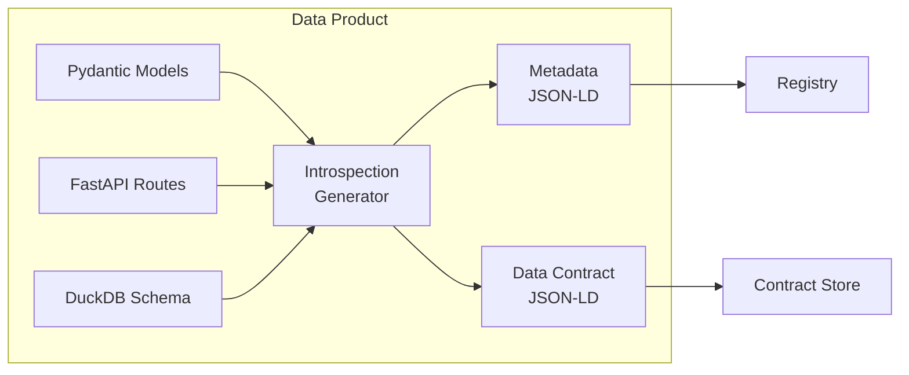

# Metadata Autogeneration Proposal

## Format Recommendation: JSON-LD

I recommend **JSON-LD** for contracts because:
1. **Native JSON**: Works seamlessly with your existing Pydantic/FastAPI stack
2. **Semantic Context**: Adds meaning without complexity via `@context`
3. **Extensible**: Easy to add domain-specific vocabularies
4. **Machine-Readable**: Better for automated validation and discovery
5. **Human-Friendly**: Still readable when kept simple

## Autogeneration Architecture



## Implementation

### 1. Metadata Introspection Module

Create `src/metadata/introspector.py`:

```python
from typing import Dict, List, Any, Optional
from pydantic import BaseModel
from fastapi import FastAPI
from datetime import datetime
import inspect
import duckdb
from ..database.connection_manager import DuckDBConnectionManager

class SchemaField(BaseModel):
    name: str
    type: str
    nullable: bool = True
    description: Optional[str] = None
    constraints: List[str] = []

class EndpointInfo(BaseModel):
    path: str
    method: str
    summary: Optional[str]
    parameters: List[Dict[str, Any]]
    response_model: Optional[str]
    rate_limit: Optional[str]

class DataProductMetadata(BaseModel):
    """Auto-generated metadata for data product"""
    # JSON-LD context
    context: Dict[str, str] = {
        "@vocab": "https://schema.org/",
        "dcat": "http://www.w3.org/ns/dcat#",
        "dcterms": "http://purl.org/dc/terms/",
        "datamesh": "https://datamesh.org/schema/"
    }
    
    # Identity
    id: str
    type: str = "dcat:Dataset"
    name: str
    version: str
    
    # Generated metadata
    tables: Dict[str, List[SchemaField]]
    endpoints: List[EndpointInfo]
    models: Dict[str, Dict[str, Any]]
    
    # Quality metrics (auto-calculated)
    data_quality_score: float
    api_coverage: float
    documentation_score: float
    
    # Timestamps
    generated_at: datetime
    schema_version: str

class MetadataIntrospector:
    def __init__(self, app: FastAPI, db_manager: DuckDBConnectionManager):
        self.app = app
        self.db_manager = db_manager
        
    async def generate_metadata(self) -> Dict[str, Any]:
        """Generate complete metadata for the data product"""
        metadata = {
            "@context": {
                "@vocab": "https://schema.org/",
                "dcat": "http://www.w3.org/ns/dcat#",
                "dcterms": "http://purl.org/dc/terms/",
                "datamesh": "https://datamesh.org/schema/"
            },
            "@type": "dcat:Dataset",
            "@id": f"urn:datamesh:finance:product:{self._get_product_id()}",
            
            # Basic info from environment
            "name": self._get_product_name(),
            "dcterms:identifier": self._get_product_id(),
            "version": self._get_version(),
            
            # Auto-discovered components
            "datamesh:dataSchemas": await self._introspect_database(),
            "datamesh:apiEndpoints": self._introspect_endpoints(),
            "datamesh:dataModels": self._introspect_models(),
            
            # Quality metrics
            "dcat:qualityMetric": self._calculate_quality_metrics(),
            
            # Operational metadata
            "dcterms:created": datetime.utcnow().isoformat(),
            "dcterms:conformsTo": "https://datamesh.org/spec/1.0",
            
            # Access information
            "dcat:accessURL": self._get_base_url(),
            "dcat:mediaType": ["application/json", "application/parquet"],
            "datamesh:protocols": ["REST", "GraphQL"] if self._has_graphql() else ["REST"],
        }
        
        return metadata
    
    async def _introspect_database(self) -> List[Dict[str, Any]]:
        """Introspect database schema"""
        schemas = []
        
        with self.db_manager.get_connection() as conn:
            # Get all tables
            tables = conn.execute("""
                SELECT table_schema, table_name 
                FROM information_schema.tables 
                WHERE table_schema NOT IN ('information_schema', 'pg_catalog')
            """).fetchall()
            
            for schema_name, table_name in tables:
                # Get columns for each table
                columns = conn.execute("""
                    SELECT 
                        column_name,
                        data_type,
                        is_nullable,
                        column_default
                    FROM information_schema.columns
                    WHERE table_schema = ? AND table_name = ?
                    ORDER BY ordinal_position
                """, [schema_name, table_name]).fetchall()
                
                schema_info = {
                    "@type": "datamesh:TableSchema",
                    "name": f"{schema_name}.{table_name}",
                    "datamesh:fields": [
                        {
                            "@type": "datamesh:Field",
                            "name": col[0],
                            "datamesh:dataType": self._map_sql_type(col[1]),
                            "datamesh:nullable": col[2] == 'YES',
                            "datamesh:defaultValue": col[3]
                        }
                        for col in columns
                    ]
                }
                schemas.append(schema_info)
        
        return schemas
    
    def _introspect_endpoints(self) -> List[Dict[str, Any]]:
        """Introspect FastAPI endpoints"""
        endpoints = []
        
        for route in self.app.routes:
            if hasattr(route, 'endpoint'):
                endpoint_info = {
                    "@type": "datamesh:APIEndpoint",
                    "datamesh:path": route.path,
                    "datamesh:methods": list(route.methods),
                    "dcterms:description": route.endpoint.__doc__ or "",
                    "datamesh:parameters": self._get_endpoint_parameters(route),
                }
                
                # Extract rate limit if present
                if hasattr(route.endpoint, '__wrapped__'):
                    for decorator in route.endpoint.__wrapped__.__decorators__:
                        if 'limit' in str(decorator):
                            endpoint_info["datamesh:rateLimit"] = str(decorator)
                
                endpoints.append(endpoint_info)
        
        return endpoints
    
    def _introspect_models(self) -> Dict[str, Dict[str, Any]]:
        """Introspect Pydantic models"""
        models = {}
        
        # Get all Pydantic models from the app
        for name, obj in inspect.getmembers(self.app):
            if inspect.isclass(obj) and issubclass(obj, BaseModel):
                schema = obj.schema()
                models[name] = {
                    "@type": "datamesh:DataModel",
                    "datamesh:modelName": name,
                    "datamesh:jsonSchema": schema
                }
        
        return models
    
    def _calculate_quality_metrics(self) -> Dict[str, float]:
        """Calculate quality metrics"""
        return {
            "@type": "dcat:QualityMeasurement",
            "datamesh:schemaCompleteness": self._calculate_schema_completeness(),
            "datamesh:apiDocumentation": self._calculate_api_documentation_score(),
            "datamesh:dataFreshness": self._calculate_data_freshness(),
        }
```

### 2. Contract Generation

Create `src/contracts/generator.py`:

```python
from typing import Dict, List, Any, Optional
from pydantic import BaseModel
from datetime import datetime, timedelta

class DataContract(BaseModel):
    """Auto-generated data contract"""
    # JSON-LD context for contracts
    context: Dict[str, str] = {
        "@vocab": "https://schema.org/",
        "dcat": "http://www.w3.org/ns/dcat#",
        "odrl": "http://www.w3.org/ns/odrl/2/",
        "datamesh": "https://datamesh.org/schema/"
    }
    
    # Contract identity
    id: str
    provider: str
    consumer: str
    
    # Terms
    data_products: List[str]
    endpoints: List[Dict[str, Any]]
    
    # SLA
    sla: Dict[str, Any]
    
    # Data quality assertions
    quality_assertions: List[Dict[str, Any]]
    
    # Validity
    valid_from: datetime
    valid_until: Optional[datetime]

class ContractGenerator:
    def __init__(self, introspector: MetadataIntrospector):
        self.introspector = introspector
    
    async def generate_contract(
        self, 
        consumer_id: str,
        requested_endpoints: List[str],
        requested_quality: Dict[str, float]
    ) -> Dict[str, Any]:
        """Generate a data contract based on consumer requirements"""
        
        # Get current metadata
        metadata = await self.introspector.generate_metadata()
        
        contract = {
            "@context": {
                "@vocab": "https://schema.org/",
                "odrl": "http://www.w3.org/ns/odrl/2/",
                "datamesh": "https://datamesh.org/contract/"
            },
            "@type": "datamesh:DataContract",
            "@id": f"urn:contract:{self._generate_contract_id()}",
            
            # Parties
            "datamesh:provider": {
                "@id": metadata["@id"],
                "name": metadata["name"]
            },
            "datamesh:consumer": {
                "@id": f"urn:consumer:{consumer_id}",
                "name": consumer_id
            },
            
            # What's being provided
            "datamesh:dataProducts": [{
                "@id": metadata["@id"],
                "datamesh:endpoints": self._filter_endpoints(
                    metadata["datamesh:apiEndpoints"], 
                    requested_endpoints
                ),
                "datamesh:schemas": metadata["datamesh:dataSchemas"]
            }],
            
            # Service Level Agreement
            "datamesh:sla": {
                "@type": "datamesh:SLA",
                "datamesh:availability": 99.9,
                "datamesh:responseTime": {
                    "p99": 500,
                    "unit": "milliseconds"
                },
                "datamesh:throughput": {
                    "max": 1000,
                    "unit": "requests/minute"
                }
            },
            
            # Quality Assertions
            "datamesh:qualityAssertions": self._generate_quality_assertions(
                requested_quality,
                metadata["dcat:qualityMetric"]
            ),
            
            # Terms
            "odrl:permission": [{
                "odrl:action": "odrl:read",
                "odrl:target": metadata["@id"],
                "odrl:constraint": {
                    "odrl:dateTime": {
                        "odrl:after": datetime.utcnow().isoformat(),
                        "odrl:before": (datetime.utcnow() + timedelta(days=365)).isoformat()
                    }
                }
            }],
            
            # Metadata
            "dcterms:created": datetime.utcnow().isoformat(),
            "dcterms:valid": {
                "start": datetime.utcnow().isoformat(),
                "end": (datetime.utcnow() + timedelta(days=365)).isoformat()
            }
        }
        
        return contract
    
    def _generate_quality_assertions(
        self, 
        requested: Dict[str, float], 
        available: Dict[str, float]
    ) -> List[Dict[str, Any]]:
        """Generate quality assertions based on requirements"""
        assertions = []
        
        for metric, requested_value in requested.items():
            available_value = available.get(metric, 0.0)
            
            assertion = {
                "@type": "datamesh:QualityAssertion",
                "datamesh:metric": metric,
                "datamesh:operator": "gte",
                "datamesh:threshold": min(requested_value, available_value),
                "datamesh:current": available_value
            }
            
            assertions.append(assertion)
        
        return assertions
```

### 3. Integration with Routes

Add to `src/routes/metadata.py`:

```python
from fastapi import APIRouter, HTTPException
from ..metadata.introspector import MetadataIntrospector
from ..contracts.generator import ContractGenerator

router = APIRouter(prefix="/metadata", tags=["metadata"])

# Initialize introspector
introspector = MetadataIntrospector(app, db_manager)
contract_generator = ContractGenerator(introspector)

@router.get("/")
async def get_metadata():
    """Get auto-generated metadata for this data product"""
    return await introspector.generate_metadata()

@router.get("/schemas")
async def get_schemas():
    """Get data schemas in JSON-LD format"""
    schemas = await introspector._introspect_database()
    return {
        "@context": "https://datamesh.org/schema/",
        "@graph": schemas
    }

@router.post("/contracts/generate")
async def generate_contract(
    consumer_id: str,
    requested_endpoints: List[str] = None,
    quality_requirements: Dict[str, float] = None
):
    """Generate a data contract for a consumer"""
    contract = await contract_generator.generate_contract(
        consumer_id=consumer_id,
        requested_endpoints=requested_endpoints or [],
        requested_quality=quality_requirements or {}
    )
    
    return contract

@router.get("/contracts/template")
async def get_contract_template():
    """Get a contract template with all available options"""
    metadata = await introspector.generate_metadata()
    
    return {
        "@context": "https://datamesh.org/contract/",
        "available_endpoints": [
            {
                "path": ep["datamesh:path"],
                "methods": ep["datamesh:methods"]
            }
            for ep in metadata["datamesh:apiEndpoints"]
        ],
        "available_quality_metrics": list(metadata["dcat:qualityMetric"].keys()),
        "sla_options": {
            "availability": [99.0, 99.9, 99.99],
            "response_time_p99_ms": [100, 500, 1000],
            "throughput_rpm": [100, 1000, 10000]
        }
    }
```

### 4. Validation & Monitoring

Create `src/contracts/validator.py`:

```python
class ContractValidator:
    def __init__(self, contract: Dict[str, Any]):
        self.contract = contract
        
    async def validate_compliance(self, metrics: Dict[str, float]) -> Dict[str, Any]:
        """Validate current metrics against contract assertions"""
        results = {
            "compliant": True,
            "violations": [],
            "warnings": []
        }
        
        for assertion in self.contract.get("datamesh:qualityAssertions", []):
            metric = assertion["datamesh:metric"]
            threshold = assertion["datamesh:threshold"]
            current = metrics.get(metric, 0)
            
            if current < threshold:
                results["compliant"] = False
                results["violations"].append({
                    "metric": metric,
                    "expected": threshold,
                    "actual": current
                })
            elif current < threshold * 1.1:  # Within 10% of threshold
                results["warnings"].append({
                    "metric": metric,
                    "message": f"Close to threshold: {current} vs {threshold}"
                })
        
        return results
```

## Example Generated Metadata

```json
{
  "@context": {
    "@vocab": "https://schema.org/",
    "dcat": "http://www.w3.org/ns/dcat#",
    "datamesh": "https://datamesh.org/schema/"
  },
  "@type": "dcat:Dataset",
  "@id": "urn:datamesh:finance:product:550e8400",
  "name": "Project Financing Data Product",
  "version": "1.2.1",
  
  "datamesh:dataSchemas": [{
    "@type": "datamesh:TableSchema",
    "name": "public.projects",
    "datamesh:fields": [{
      "name": "project_id",
      "datamesh:dataType": "uuid",
      "datamesh:nullable": false
    }]
  }],
  
  "datamesh:apiEndpoints": [{
    "@type": "datamesh:APIEndpoint",
    "datamesh:path": "/ops/projects",
    "datamesh:methods": ["GET", "POST"],
    "datamesh:rateLimit": "10/minute"
  }],
  
  "dcat:qualityMetric": {
    "datamesh:schemaCompleteness": 0.95,
    "datamesh:apiDocumentation": 0.90,
    "datamesh:dataFreshness": 0.99
  }
}
```

## Example Generated Contract

```json
{
  "@context": {
    "@vocab": "https://schema.org/",
    "datamesh": "https://datamesh.org/contract/"
  },
  "@type": "datamesh:DataContract",
  "@id": "urn:contract:abc123",
  
  "datamesh:provider": {
    "@id": "urn:datamesh:finance:product:550e8400",
    "name": "Project Financing Data Product"
  },
  
  "datamesh:consumer": {
    "@id": "urn:consumer:analytics-team",
    "name": "analytics-team"
  },
  
  "datamesh:sla": {
    "datamesh:availability": 99.9,
    "datamesh:responseTime": {
      "p99": 500,
      "unit": "milliseconds"
    }
  },
  
  "datamesh:qualityAssertions": [{
    "datamesh:metric": "dataFreshness",
    "datamesh:operator": "gte",
    "datamesh:threshold": 0.95
  }]
}
```

## Benefits

1. **Zero Manual Work**: All metadata generated from code
2. **Always Current**: Reflects actual implementation
3. **Semantic**: JSON-LD provides meaning and context
4. **Validatable**: Contracts can be automatically validated
5. **Extensible**: Easy to add domain-specific fields

Total implementation: ~400 lines for complete autogeneration!