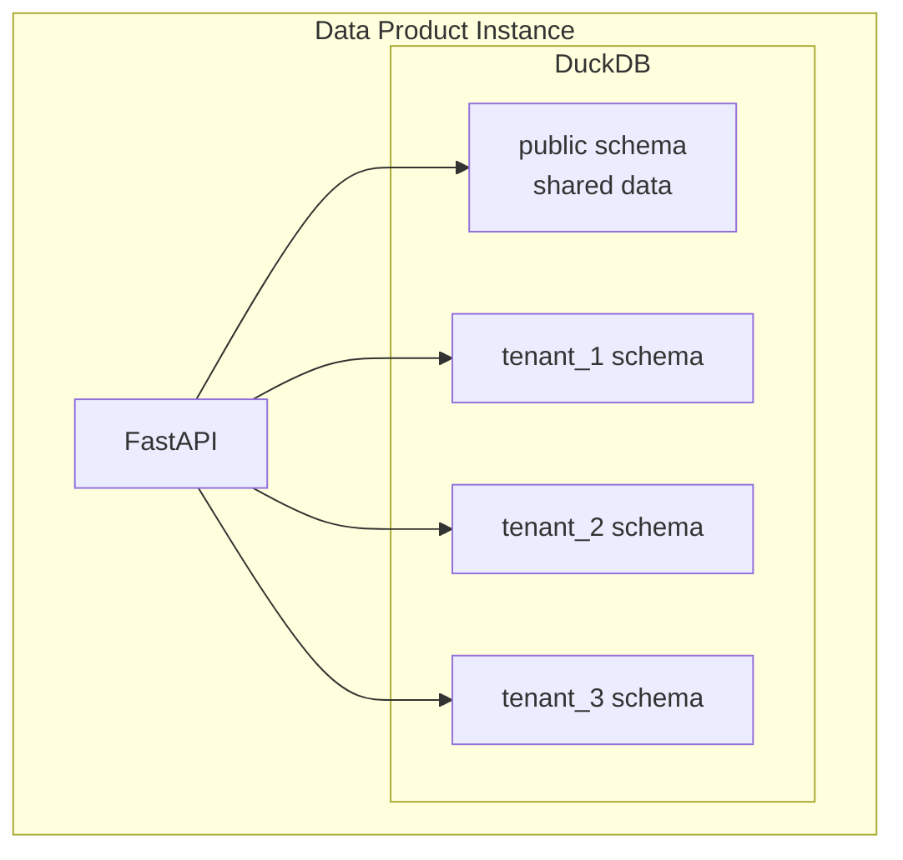
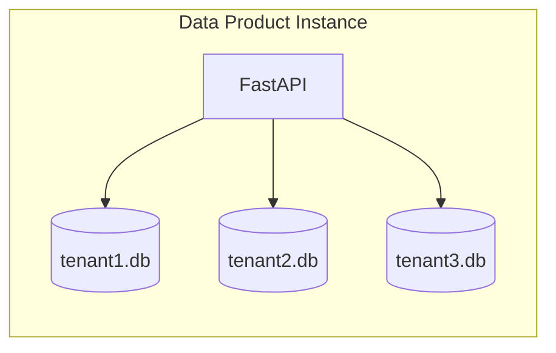

# Multi-Tenancy Proposal for Data Mesh

## Overview

A pragmatic multi-tenancy approach that leverages DuckDB's schema capabilities and FastAPI's middleware system. This design supports both shared and isolated deployment models without adding complexity.

## Architecture Options

### Option 1: Schema-Based Isolation (Recommended)



### Option 2: Database-Per-Tenant



## Implementation (Schema-Based)

### 1. Tenant Context Middleware

Create `src/middleware/tenant.py`:

```python
from fastapi import Request, HTTPException
from typing import Optional
import jwt
import os

class TenantContext:
    """Thread-local tenant context"""
    _tenant_id: Optional[str] = None
    
    @classmethod
    def set_tenant(cls, tenant_id: str):
        cls._tenant_id = tenant_id
    
    @classmethod
    def get_tenant(cls) -> Optional[str]:
        return cls._tenant_id
    
    @classmethod
    def clear(cls):
        cls._tenant_id = None

async def tenant_middleware(request: Request, call_next):
    """Extract and set tenant context from request"""
    try:
        # Option 1: From JWT token
        auth_header = request.headers.get("Authorization", "")
        if auth_header.startswith("Bearer "):
            token = auth_header.split(" ")[1]
            payload = jwt.decode(
                token, 
                os.getenv("JWT_SECRET", "secret"), 
                algorithms=["HS256"]
            )
            tenant_id = payload.get("tenant_id")
        
        # Option 2: From header
        elif "X-Tenant-ID" in request.headers:
            tenant_id = request.headers["X-Tenant-ID"]
        
        # Option 3: From subdomain
        elif "." in request.headers.get("host", ""):
            tenant_id = request.headers["host"].split(".")[0]
        
        else:
            # Default tenant for backwards compatibility
            tenant_id = "default"
        
        # Validate tenant
        if not tenant_id or not tenant_id.replace("-", "").isalnum():
            raise HTTPException(status_code=400, detail="Invalid tenant ID")
        
        TenantContext.set_tenant(tenant_id)
        response = await call_next(request)
        TenantContext.clear()
        
        return response
        
    except Exception as e:
        TenantContext.clear()
        raise
```

### 2. Update Connection Manager

Modify `src/database/connection_manager.py`:

```python
from contextlib import contextmanager
from typing import Generator, Optional
import duckdb
from ..middleware.tenant import TenantContext

class TenantAwareConnectionPool:
    """Connection pool with tenant awareness"""
    
    def __init__(self, db_path: str = "data/data_product.db"):
        self.db_path = db_path
        self.initialized_tenants = set()
        
    @contextmanager
    def get_connection(self, tenant_id: Optional[str] = None) -> Generator[duckdb.DuckDBPyConnection, None, None]:
        """Get a connection with tenant context"""
        if not tenant_id:
            tenant_id = TenantContext.get_tenant() or "default"
        
        connection = duckdb.connect(self.db_path)
        
        try:
            # Initialize tenant schema if needed
            if tenant_id not in self.initialized_tenants:
                self._initialize_tenant_schema(connection, tenant_id)
                self.initialized_tenants.add(tenant_id)
            
            # Set search path to tenant schema
            if tenant_id != "default":
                connection.execute(f"SET search_path = tenant_{tenant_id}, public")
            
            yield connection
            
        finally:
            connection.close()
    
    def _initialize_tenant_schema(self, conn: duckdb.DuckDBPyConnection, tenant_id: str):
        """Initialize schema for a new tenant"""
        if tenant_id == "default":
            return  # Use public schema for default
        
        schema_name = f"tenant_{tenant_id}"
        
        # Create schema if not exists
        conn.execute(f"CREATE SCHEMA IF NOT EXISTS {schema_name}")
        
        # Create tenant-specific tables
        conn.execute(f"""
            CREATE TABLE IF NOT EXISTS {schema_name}.projects (
                project_id UUID PRIMARY KEY,
                project_name VARCHAR NOT NULL,
                description TEXT,
                total_amount DECIMAL(20,2) NOT NULL,
                maturity_years INTEGER NOT NULL,
                expected_tri DECIMAL(5,2) NOT NULL,
                dscr DECIMAL(5,2) NOT NULL,
                status VARCHAR NOT NULL,
                creation_date DATE NOT NULL,
                last_updated TIMESTAMP NOT NULL,
                currency_code CHAR(3) NOT NULL DEFAULT 'USD'
            )
        """)
        
        # Add other tables...
        conn.commit()

# Update the singleton to use tenant-aware pool
class DuckDBConnectionManager:
    _instance = None
    _pool = None

    def __new__(cls):
        if cls._instance is None:
            cls._instance = super(DuckDBConnectionManager, cls).__new__(cls)
            cls._pool = TenantAwareConnectionPool()
        return cls._instance

    @contextmanager
    def get_connection(self, tenant_id: Optional[str] = None) -> Generator[duckdb.DuckDBPyConnection, None, None]:
        with self._pool.get_connection(tenant_id) as conn:
            yield conn
```

### 3. Tenant Configuration

Create `src/models/tenant.py`:

```python
from pydantic import BaseModel, Field
from typing import Optional, Dict
from datetime import datetime
from enum import Enum

class TenantTier(str, Enum):
    STARTER = "starter"
    PROFESSIONAL = "professional"
    ENTERPRISE = "enterprise"

class TenantLimits(BaseModel):
    max_projects: int = 100
    max_api_calls_per_day: int = 10000
    max_storage_gb: float = 10.0
    data_retention_days: int = 90

class TenantConfig(BaseModel):
    tenant_id: str
    name: str
    tier: TenantTier = TenantTier.STARTER
    limits: TenantLimits = Field(default_factory=TenantLimits)
    features: Dict[str, bool] = {
        "graphql_api": False,
        "advanced_analytics": False,
        "data_export": True,
        "api_webhooks": False
    }
    created_at: datetime = Field(default_factory=datetime.utcnow)
    is_active: bool = True
```

### 4. Tenant Management Routes

Create `src/routes/tenants.py`:

```python
from fastapi import APIRouter, HTTPException, Depends
from typing import List
from ..models.tenant import TenantConfig, TenantTier
from ..database.connection_manager import DuckDBConnectionManager
from ..middleware.tenant import TenantContext

router = APIRouter(prefix="/admin/tenants", tags=["tenant-management"])
db_manager = DuckDBConnectionManager()

# Store tenant configs in a system table
TENANT_TABLE = """
CREATE TABLE IF NOT EXISTS system.tenants (
    tenant_id VARCHAR PRIMARY KEY,
    config_json TEXT NOT NULL,
    created_at TIMESTAMP NOT NULL,
    updated_at TIMESTAMP NOT NULL
)
"""

@router.post("/", response_model=TenantConfig)
async def create_tenant(config: TenantConfig):
    """Create a new tenant (admin only)"""
    with db_manager.get_connection("system") as conn:
        # Ensure system schema exists
        conn.execute("CREATE SCHEMA IF NOT EXISTS system")
        conn.execute(TENANT_TABLE)
        
        # Check if tenant exists
        existing = conn.execute(
            "SELECT 1 FROM system.tenants WHERE tenant_id = ?",
            [config.tenant_id]
        ).fetchone()
        
        if existing:
            raise HTTPException(status_code=409, detail="Tenant already exists")
        
        # Insert tenant config
        conn.execute("""
            INSERT INTO system.tenants (tenant_id, config_json, created_at, updated_at)
            VALUES (?, ?, ?, ?)
        """, [
            config.tenant_id,
            config.json(),
            config.created_at,
            config.created_at
        ])
        
        conn.commit()
    
    return config

@router.get("/{tenant_id}", response_model=TenantConfig)
async def get_tenant(tenant_id: str):
    """Get tenant configuration"""
    with db_manager.get_connection("system") as conn:
        result = conn.execute(
            "SELECT config_json FROM system.tenants WHERE tenant_id = ?",
            [tenant_id]
        ).fetchone()
        
        if not result:
            raise HTTPException(status_code=404, detail="Tenant not found")
        
        return TenantConfig.parse_raw(result[0])
```

### 5. Tenant-Aware Operations

Update `src/routes/operations.py`:

```python
from fastapi import Request, HTTPException, Depends
from typing import List
from ..models.tenant import TenantConfig, TenantTier
from ..database.connection_manager import DuckDBConnectionManager
from ..middleware.tenant import TenantContext
import uuid
from datetime import datetime
from ..utils.rate_limiter import limiter

router = APIRouter(prefix="/ops", tags=["operations"])
db_manager = DuckDBConnectionManager()

# Placeholder for other models/schemas
class Project(BaseModel):
    project_name: str
    description: Optional[str] = None
    total_amount: float
    maturity_years: int
    expected_tri: float
    dscr: float
    status: str
    currency_code: str = "USD"

async def get_tenant_config(tenant_id: str) -> TenantConfig:
    """Helper to get tenant config from DB"""
    with db_manager.get_connection("system") as conn:
        result = conn.execute(
            "SELECT config_json FROM system.tenants WHERE tenant_id = ?",
            [tenant_id]
        ).fetchone()
        if not result:
            raise HTTPException(status_code=404, detail="Tenant not found")
        return TenantConfig.parse_raw(result[0])

async def get_project_count(tenant_id: str) -> int:
    """Helper to get project count for a tenant"""
    with db_manager.get_connection(tenant_id) as conn:
        result = conn.execute(
            "SELECT COUNT(*) FROM projects"
        ).fetchone()
        return result[0]

@router.post("/projects", response_model=dict)
@limiter.limit("10/minute")
async def create_project(request: Request, project: Project):
    """Create a new project in tenant's schema"""
    tenant_id = TenantContext.get_tenant()
    
    # Check tenant limits
    tenant_config = await get_tenant_config(tenant_id)
    current_count = await get_project_count(tenant_id)
    
    if current_count >= tenant_config.limits.max_projects:
        raise HTTPException(
            status_code=429, 
            detail=f"Project limit ({tenant_config.limits.max_projects}) reached"
        )
    
    with db_manager.get_connection() as conn:
        # Projects will be created in tenant's schema due to search_path
        result = conn.execute("""
            INSERT INTO projects (
                project_id, project_name, description, total_amount,
                maturity_years, expected_tri, dscr, status,
                creation_date, last_updated, currency_code
            ) VALUES (?, ?, ?, ?, ?, ?, ?, ?, ?, ?, ?)
            RETURNING project_id
        """, [
            str(uuid.uuid4()),
            project.project_name,
            project.description,
            project.total_amount,
            project.maturity_years,
            project.expected_tri,
            project.dscr,
            project.status.value,
            datetime.now().date(),
            datetime.now(),
            project.currency_code
        ]).fetchone()
        
        conn.commit()
        
    return {"project_id": str(result[0]), "status": "created"}
```

### 6. Cross-Tenant Analytics (Optional)

For admin/analytics across tenants:

```python
from fastapi import APIRouter, Depends
from typing import List
from ..models.tenant import TenantConfig
from ..database.connection_manager import DuckDBConnectionManager
from ..middleware.tenant import TenantContext
from fastapi.security import HTTPBearer
import jwt
import os

router = APIRouter(prefix="/analytics", tags=["analytics"])
db_manager = DuckDBConnectionManager()

# Placeholder for other models/schemas
class TenantConfig(BaseModel):
    tenant_id: str
    name: str
    tier: TenantTier = TenantTier.STARTER
    limits: TenantLimits = Field(default_factory=TenantLimits)
    features: Dict[str, bool] = {
        "graphql_api": False,
        "advanced_analytics": False,
        "data_export": True,
        "api_webhooks": False
    }
    created_at: datetime = Field(default_factory=datetime.utcnow)
    is_active: bool = True

async def verify_admin(token: str = Depends(HTTPBearer())):
    """Verify admin token"""
    try:
        payload = jwt.decode(
            token.credentials,
            os.getenv("JWT_SECRET", "secret"),
            algorithms=["HS256"]
        )
        if payload.get("role") != "admin":
            raise HTTPException(status_code=403, detail="Admin role required")
        return payload
    except jwt.ExpiredSignatureError:
        raise HTTPException(status_code=401, detail="Token expired")
    except jwt.InvalidTokenError:
        raise HTTPException(status_code=401, detail="Invalid token")

@router.get("/cross-tenant", tags=["admin"])
async def cross_tenant_analytics(admin_token: str = Depends(verify_admin)):
    """Get analytics across all tenants"""
    with db_manager.get_connection("system") as conn:
        # Get all active tenants
        tenants = conn.execute("""
            SELECT tenant_id, config_json 
            FROM system.tenants 
            WHERE config_json::json->>'is_active' = 'true'
        """).fetchall()
        
        analytics = []
        for tenant_id, config_json in tenants:
            config = TenantConfig.parse_raw(config_json)
            
            # Query each tenant's schema
            stats = conn.execute(f"""
                SELECT 
                    COUNT(*) as project_count,
                    SUM(total_amount) as total_value,
                    AVG(expected_tri) as avg_tri
                FROM tenant_{tenant_id}.projects
                WHERE status = 'ACTIVE'
            """).fetchone()
            
            analytics.append({
                "tenant_id": tenant_id,
                "tenant_name": config.name,
                "tier": config.tier,
                "project_count": stats[0] or 0,
                "total_value": float(stats[1] or 0),
                "avg_tri": float(stats[2] or 0)
            })
        
        return {"analytics": analytics}
```

### 7. Data Isolation Patterns

```python
# src/utils/tenant_isolation.py
from functools import wraps
from fastapi import HTTPException
from ..middleware.tenant import TenantContext

def tenant_isolated(func):
    """Decorator to ensure queries are tenant-isolated"""
    @wraps(func)
    async def wrapper(*args, **kwargs):
        tenant_id = TenantContext.get_tenant()
        if not tenant_id:
            raise HTTPException(status_code=401, detail="No tenant context")
        
        # Add tenant_id to kwargs if function accepts it
        if 'tenant_id' in func.__code__.co_varnames:
            kwargs['tenant_id'] = tenant_id
        
        return await func(*args, **kwargs)
    return wrapper

# Usage:
@tenant_isolated
async def get_tenant_projects(tenant_id: str):
    # Automatically receives tenant_id from context
    pass
```

## Deployment Strategies

### 1. Single Instance, Multiple Tenants
```yaml
# docker-compose.yml
services:
  data-product:
    image: duckdb-spawn:latest
    environment:
      - MULTI_TENANT_MODE=true
      - DEFAULT_TENANT_TIER=starter
    volumes:
      - ./data:/app/data  # All tenants share storage
```

### 2. Tenant-Specific Instances
```yaml
# docker-compose.tenant-a.yml
services:
  data-product-tenant-a:
    image: duckdb-spawn:latest
    environment:
      - TENANT_ID=tenant-a
      - SINGLE_TENANT_MODE=true
    volumes:
      - ./data/tenant-a:/app/data
    ports:
      - "8001:8000"
```

### 3. Hybrid Approach
- Starter/Professional tiers: Shared instance with schema isolation
- Enterprise tier: Dedicated instance with full isolation

## Migration Path

```python
# src/scripts/migrate_to_multitenant.py
import duckdb
from pathlib import Path

def migrate_existing_data(db_path: str, target_tenant: str = "default"):
    """Migrate single-tenant data to multi-tenant structure"""
    conn = duckdb.connect(db_path)
    
    # Create tenant schema
    if target_tenant != "default":
        schema_name = f"tenant_{target_tenant}"
        conn.execute(f"CREATE SCHEMA IF NOT EXISTS {schema_name}")
        
        # Get all tables
        tables = conn.execute("""
            SELECT table_name 
            FROM information_schema.tables 
            WHERE table_schema = 'main'
        """).fetchall()
        
        # Copy tables to tenant schema
        for (table_name,) in tables:
            print(f"Migrating table: {table_name}")
            conn.execute(f"""
                CREATE TABLE {schema_name}.{table_name} AS 
                SELECT * FROM main.{table_name}
            """)
    
    conn.close()
    print(f"Migration completed for tenant: {target_tenant}")
```

## Security Considerations

1. **Tenant Isolation**: Schema-level isolation prevents cross-tenant data access
2. **Connection String Validation**: Prevent SQL injection in schema names
3. **Resource Limits**: Implement per-tenant quotas
4. **Audit Logging**: Track all cross-tenant operations

## Monitoring

```python
# Add to metrics
tenant_request_count = Counter(
    'tenant_request_count',
    'Requests per tenant',
    ['tenant_id', 'endpoint']
)

tenant_storage_bytes = Gauge(
    'tenant_storage_bytes',
    'Storage used per tenant',
    ['tenant_id']
)
```

## Benefits

- **Simple**: Leverages DuckDB's schema support
- **Efficient**: Shared resources for small tenants
- **Flexible**: Easy to move tenants between isolation levels
- **Backwards Compatible**: Default tenant for existing deployments