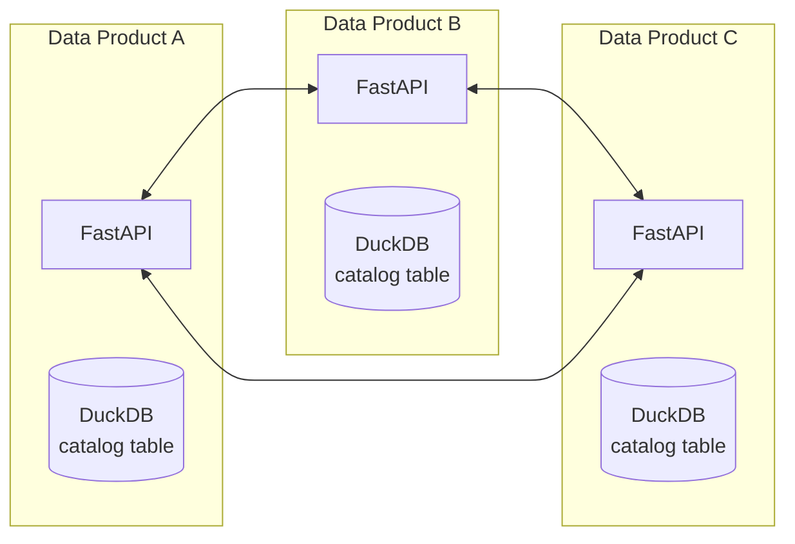

# Simple Decentralized Catalog for Data Mesh

## Overview

A minimal catalog system that leverages your existing DuckDB and FastAPI stack. Each data product maintains its own catalog table and periodically syncs with peers.

## Core Design



## Implementation

### 1. Catalog Table Schema

Add to your existing `src/database/schema.py`:

```python
# Additional schema for catalog
CATALOG_SCHEMA = """
    CREATE TABLE IF NOT EXISTS data_product_catalog (
        -- Identity
        product_id UUID PRIMARY KEY,
        name VARCHAR NOT NULL,
        domain VARCHAR NOT NULL,
        version VARCHAR NOT NULL,
        
        -- Access
        base_url VARCHAR NOT NULL,
        health_endpoint VARCHAR DEFAULT '/health',
        
        -- Metadata
        description TEXT,
        owner_email VARCHAR,
        quality_score DECIMAL(3,2) DEFAULT 0.5,
        
        -- Discovery
        last_seen TIMESTAMP NOT NULL,
        first_discovered TIMESTAMP NOT NULL,
        is_self BOOLEAN DEFAULT FALSE,
        
        -- Technical
        supports_sql BOOLEAN DEFAULT TRUE,
        supports_graphql BOOLEAN DEFAULT FALSE
    )
"""

# Add to SCHEMA_DEFINITIONS
SCHEMA_DEFINITIONS["catalog"] = CATALOG_SCHEMA
```

### 2. Simple Catalog Model

Add to a new file `src/models/catalog.py`:

```python
from pydantic import BaseModel, Field
from datetime import datetime
from typing import Optional
import uuid

class DataProductInfo(BaseModel):
    """Minimal data product information for catalog"""
    product_id: str = Field(default_factory=lambda: str(uuid.uuid4()))
    name: str
    domain: str
    version: str = "1.0.0"
    base_url: str
    description: Optional[str] = None
    owner_email: Optional[str] = None
    quality_score: float = Field(default=0.5, ge=0, le=1)
    supports_sql: bool = True
    supports_graphql: bool = False
    
class CatalogEntry(DataProductInfo):
    """Catalog entry with timestamps"""
    last_seen: datetime = Field(default_factory=datetime.utcnow)
    first_discovered: datetime = Field(default_factory=datetime.utcnow)
    is_self: bool = False
```

### 3. Catalog Routes

Add new file `src/routes/catalog.py`:

```python
from fastapi import APIRouter, HTTPException, BackgroundTasks
from typing import List
import httpx
from datetime import datetime, timedelta
import asyncio
import os

from ..models.catalog import DataProductInfo, CatalogEntry
from ..database.connection_manager import DuckDBConnectionManager

router = APIRouter(prefix="/catalog", tags=["catalog"])
db_manager = DuckDBConnectionManager()

# Self information
SELF_INFO = DataProductInfo(
    product_id=os.getenv("PRODUCT_ID", "550e8400-e29b-41d4-a716-446655440000"),
    name=os.getenv("PRODUCT_NAME", "Project Financing Data Product"),
    domain="finance",
    version="1.2.1",
    base_url=os.getenv("BASE_URL", "http://localhost:8000"),
    description="Manages project financing data",
    owner_email="finance-team@example.com",
    quality_score=0.95
)

# Seed peers from environment
SEED_PEERS = os.getenv("CATALOG_PEERS", "").split(",")
SEED_PEERS = [p.strip() for p in SEED_PEERS if p.strip()]

@router.get("/info", response_model=DataProductInfo)
async def get_product_info():
    """Get this data product's information"""
    return SELF_INFO

@router.get("/peers", response_model=List[CatalogEntry])
async def list_peers(domain: str = None, include_self: bool = True):
    """List known data products"""
    with db_manager.get_connection() as conn:
        query = "SELECT * FROM data_product_catalog WHERE 1=1"
        params = []
        
        if not include_self:
            query += " AND is_self = false"
        
        if domain:
            query += " AND domain = ?"
            params.append(domain)
            
        query += " ORDER BY quality_score DESC, name"
        
        result = conn.execute(query, params).fetchall()
        
        return [
            CatalogEntry(
                product_id=row[0],
                name=row[1],
                domain=row[2],
                version=row[3],
                base_url=row[4],
                description=row[6],
                owner_email=row[7],
                quality_score=row[8],
                last_seen=row[9],
                first_discovered=row[10],
                is_self=row[11],
                supports_sql=row[12],
                supports_graphql=row[13]
            )
            for row in result
        ]

@router.post("/sync")
async def sync_catalog(background_tasks: BackgroundTasks):
    """Trigger catalog synchronization with known peers"""
    background_tasks.add_task(sync_with_peers)
    return {"status": "sync initiated"}

async def sync_with_peers():
    """Background task to sync with all known peers"""
    # Get active peers
    with db_manager.get_connection() as conn:
        peers = conn.execute("""
            SELECT base_url FROM data_product_catalog 
            WHERE is_self = false 
            AND last_seen > datetime('now', '-1 day')
        """).fetchall()
    
    peer_urls = [row[0] for row in peers] + SEED_PEERS
    
    # Sync with each peer
    async with httpx.AsyncClient(timeout=5.0) as client:
        tasks = [sync_with_peer(client, url) for url in peer_urls]
        await asyncio.gather(*tasks, return_exceptions=True)

async def sync_with_peer(client: httpx.AsyncClient, peer_url: str):
    """Sync catalog with a single peer"""
    try:
        # Get peer's info
        response = await client.get(f"{peer_url}/catalog/info")
        if response.status_code == 200:
            peer_info = DataProductInfo(**response.json())
            update_catalog_entry(peer_info)
        
        # Get peer's known peers
        response = await client.get(f"{peer_url}/catalog/peers")
        if response.status_code == 200:
            peers = response.json()
            for peer_data in peers[:20]:  # Limit to prevent explosion
                entry = CatalogEntry(**peer_data)
                if entry.product_id != SELF_INFO.product_id:
                    update_catalog_entry(entry)
    except Exception as e:
        print(f"Failed to sync with {peer_url}: {e}")

def update_catalog_entry(entry: DataProductInfo):
    """Update or insert catalog entry"""
    with db_manager.get_connection() as conn:
        # Check if exists
        existing = conn.execute(
            "SELECT product_id FROM data_product_catalog WHERE product_id = ?",
            [entry.product_id]
        ).fetchone()
        
        if existing:
            # Update
            conn.execute("""
                UPDATE data_product_catalog 
                SET name = ?, domain = ?, version = ?, base_url = ?,
                    description = ?, owner_email = ?, quality_score = ?,
                    last_seen = datetime('now'), supports_sql = ?, 
                    supports_graphql = ?
                WHERE product_id = ?
            """, [
                entry.name, entry.domain, entry.version, entry.base_url,
                entry.description, entry.owner_email, entry.quality_score,
                entry.supports_sql, entry.supports_graphql, entry.product_id
            ])
        else:
            # Insert
            conn.execute("""
                INSERT INTO data_product_catalog (
                    product_id, name, domain, version, base_url,
                    description, owner_email, quality_score, last_seen,
                    first_discovered, is_self, supports_sql, supports_graphql
                ) VALUES (?, ?, ?, ?, ?, ?, ?, ?, datetime('now'), 
                         datetime('now'), false, ?, ?)
            """, [
                entry.product_id, entry.name, entry.domain, entry.version,
                entry.base_url, entry.description, entry.owner_email,
                entry.quality_score, entry.supports_sql, entry.supports_graphql
            ])
        
        conn.commit()

# Initialize self entry on startup
@router.on_event("startup")
async def initialize_catalog():
    """Initialize catalog with self entry"""
    with db_manager.get_connection() as conn:
        # Ensure catalog table exists
        conn.execute(CATALOG_SCHEMA)
        
        # Insert or update self
        conn.execute("""
            INSERT OR REPLACE INTO data_product_catalog (
                product_id, name, domain, version, base_url,
                description, owner_email, quality_score, last_seen,
                first_discovered, is_self, supports_sql, supports_graphql
            ) VALUES (?, ?, ?, ?, ?, ?, ?, ?, datetime('now'), 
                     datetime('now'), true, ?, ?)
        """, [
            SELF_INFO.product_id, SELF_INFO.name, SELF_INFO.domain,
            SELF_INFO.version, SELF_INFO.base_url, SELF_INFO.description,
            SELF_INFO.owner_email, SELF_INFO.quality_score,
            SELF_INFO.supports_sql, SELF_INFO.supports_graphql
        ])
        conn.commit()

# Periodic sync task
async def periodic_sync():
    """Run sync every 5 minutes"""
    while True:
        await asyncio.sleep(300)  # 5 minutes
        await sync_with_peers()

@router.on_event("startup")
async def start_periodic_sync():
    """Start background sync task"""
    asyncio.create_task(periodic_sync())
```

### 4. Add to Main App

In `src/main.py`, add:

```python
from .routes import admin, monitoring, operations, catalog

# Register routes
app.include_router(admin.router)
app.include_router(operations.router)
app.include_router(monitoring.router)
app.include_router(catalog.router)  # Add this line
```

### 5. Simple Discovery Query

Add to `src/routes/catalog.py`:

```python
@router.get("/discover")
async def discover_data_products(
    domain: str = None,
    min_quality: float = 0.0,
    limit: int = 50
):
    """Simple discovery endpoint"""
    with db_manager.get_connection() as conn:
        query = """
            SELECT * FROM data_product_catalog 
            WHERE quality_score >= ?
            AND last_seen > datetime('now', '-7 days')
        """
        params = [min_quality]
        
        if domain:
            query += " AND domain = ?"
            params.append(domain)
        
        query += " ORDER BY quality_score DESC LIMIT ?"
        params.append(limit)
        
        results = conn.execute(query, params).fetchall()
        
        return {
            "count": len(results),
            "products": [
                {
                    "name": row[1],
                    "domain": row[2],
                    "url": row[4],
                    "description": row[6],
                    "quality_score": row[8]
                }
                for row in results
            ]
        }
```

## Configuration

Add to your `.env`:

```bash
# Catalog Configuration
PRODUCT_ID=550e8400-e29b-41d4-a716-446655440000
PRODUCT_NAME=Project Financing Data Product
BASE_URL=https://finance-dp.example.com

# Comma-separated list of peer URLs for bootstrap
CATALOG_PEERS=https://hr-dp.example.com,https://sales-dp.example.com
```

## Usage

1. **Self-registration**: Automatic on startup
2. **Discovery**: `GET /catalog/discover?domain=finance`
3. **List peers**: `GET /catalog/peers`
4. **Manual sync**: `POST /catalog/sync`
5. **Automatic sync**: Every 5 minutes in background

## Benefits

- **Dead simple**: Just one table, a few endpoints
- **No new dependencies**: Uses existing DuckDB and FastAPI
- **Resilient**: Works even if peers are down
- **Efficient**: Leverages DuckDB's query capabilities
- **Gradual adoption**: Products can join anytime

## Monitoring

Add to existing metrics:

```python
# In src/utils/metrics.py
catalog_peer_count = Gauge(
    'catalog_peer_count',
    'Number of discovered data products'
)

catalog_sync_duration = Histogram(
    'catalog_sync_duration_seconds',
    'Time to sync with peers'
)
```

## Total Lines of Code

- Schema addition: ~20 lines
- Model: ~25 lines  
- Routes: ~200 lines
- Total: **~245 lines** for a complete decentralized catalog

This is all you need for a functional decentralized catalog that fits perfectly with your existing architecture!